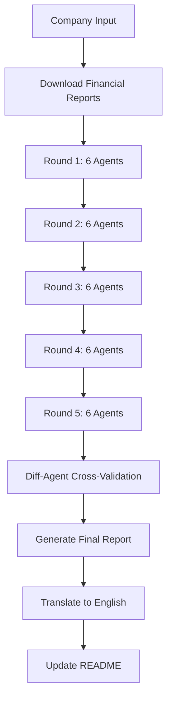

# Investment Research Reports

Automated investment research reports generated through multi-agent analysis system.

---

## 📊 Analysis Methodology

Each company report is generated through a rigorous **5-round analysis process**:

- **Round 1-5**: Each round consists of 6 specialized agents analyzing different aspects
- **Total Analyses**: 30 independent analyses per company
- **Cross-validation**: Diff-agent compares all rounds and resolves conflicts
- **Final Report**: Generated based on validated, consistent data

### Analysis Agents

| Agent | Focus Area |
|-------|-----------|
| **segment-agent** | Business segments and cost structure |
| **balance-agent** | Balance sheet analysis |
| **value-agent** | Enterprise valuation (DCF, multiples) |
| **cap-agent** | Capital allocation (dividends, buybacks) |
| **cap-acq-agent** | Investment and acquisition activities |
| **mda-agent** | Management discussion & strategy |

---

## 📁 Latest Reports

### COMPANY_NAME Investment Research

**Analysis Date**: UPDATE_DATE
**Rounds**: 5 rounds × 6 agents = 30 independent analyses
**Exchange**: EXCHANGE_TYPE

#### Quick Stats

| Metric | Value |
|--------|-------|
KEY_METRICS_TABLE

#### Investment Rating

**RATING**: RATING_VALUE

**Recommendation**: RECOMMENDATION_TEXT

#### Key Insights

KEY_INSIGHTS

- [Full English Report](REPORT_PATH) - Complete analysis in English
- [中文报告](REPORT_PATH_CN) - 完整中文版报告

#### Analysis Details

| Module | Rounds | Consistency |
|--------|--------|-------------|
MODULE_CONSISTENCY_TABLE

---

## 📈 Recent Updates

### UPDATE_HISTORY

---

## 🔧 System Architecture

### Automation Pipeline



### Data Sources

- **US Companies**: SEC EDGAR (10-K, 20-F filings)
- **HK Companies**: HKEXnews (annual reports)
- **Financial Data**: StockAnalysis.com
- **Validation**: Cross-validated across multiple sources

---

## 🎯 How to Use

### Generate New Report

```bash
# Using Claude Code
/研究 Apple Inc.

# Or use the automated script
python auto_analysis.py "Apple Inc." SEC
```

### Report Structure

Each report includes:
1. **Executive Summary**: Key findings and investment rating
2. **Business Analysis**: Segments, cost structure, regional distribution
3. **Financial Health**: Balance sheet, debt analysis, liquidity
4. **Valuation**: DCF model, sensitivity analysis, fair value
5. **Capital Allocation**: Dividend policy, share buybacks, investments
6. **Management Assessment**: Team quality, strategy, credibility
7. **Investment Recommendation**: Clear buy/hold/sell guidance

---

## 📝 Disclaimer

**IMPORTANT**: These reports are for research and educational purposes only. They do not constitute investment advice. Always conduct your own due diligence and consult with qualified financial advisors before making investment decisions.

### Risk Factors
- Past performance does not guarantee future results
- Market conditions can change rapidly
- Analysis based on historical data may not predict future performance
- Currency fluctuations may affect returns for foreign companies

---

## 📞 Contact

For questions or feedback about the research methodology, please open an issue in the repository.

---

*Last Updated: LAST_UPDATE_DATE*
*Generated by Claude Code Investment Research System*
